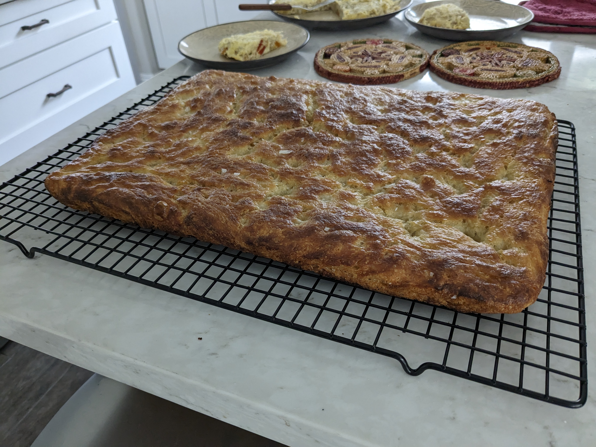

# :bread: Ligurian Focaccia

{ loading=lazy }

| :timer_clock: Total Time |
|:-----------------------: |
| 15.95 hours |

## :salt: Ingredients - Bread

- :droplet: 600 g lukewarm water
- :microbe: 0.5 tsp active dry yeast
- :honey_pot: 15 g honey
- :ear_of_rice: 800 g all-purpose flour
- :salt: 18 g salt
- :olive: 50 g olive oil

## :salt: Ingredients - Brine

- :salt: 5 g salt
- :droplet: 80 g lukewarm water

## :cooking: Cookware

- 1 medium bowl
- 1 very large bowl
- 1 rubber spatula
- 1 plastic wrap
- 1 18 x 13 inch (46-by-33 cm) rimmed baking sheet
- 1 spatula
- 1 metal spatula

## :pencil: Instructions

### Step 1

In a medium bowl, stir together lukewarm water, active dry yeast, and honey to dissolve. In a very large bowl, whisk
all-purpose flour and salt together to combine and then add yeast mixture and olive oil. Stir with a rubber spatula
until just incorporated, then scrape the sides of the bowl clean and cover with plastic wrap. Leave out at room
temperature to ferment for 12 to 14 hours until at least doubled in volume.

### Step 2

Spread 2 to 3 tablespoons oil evenly onto an 18 x 13 inch (46-by-33 cm) rimmed baking sheet. When dough is ready, use a
spatula or your hand to release it from the sides of the bowl and fold it onto itself gently, then pour out onto pan.
Pour an additional 2 tablespoons of olive oil over dough and gently spread across. Gently stretch the dough to the edge
of the sheet by placing your hands underneath and pulling outward. The dough will shrink a bit, so repeat stretching
once or twice over the course of 30 minutes to ensure dough remains stretched.

### Step 3

Dimple the dough by pressing the pads of your first three fingers in at an angle.  Make the brine by stirring together
salt and lukewarm water until salt is dissolved. Pour the brine over the dough to fill dimples. Proof focaccia for 45
minutes until the dough is light and bubbly.

### Step 4

Thirty minutes into this final proof, adjust rack to center position and preheat oven to 450°F (235°C). If you have a
baking stone, place it on rack. Otherwise, invert another sturdy baking sheet and place on rack. Allow to preheat with
the oven until very hot, before proceeding with baking.

### Step 5

Sprinkle focaccia with flaky salt. Bake for 25 to 30 minutes directly on top of stone or inverted pan until bottom crust
is crisp and golden brown when checked with a metal spatula. To finish browning top crust, place focaccia on upper rack
and bake for 5 to 7 minutes more.

### Step 6

Remove from oven and brush or douse with 2 to 3 tablespoons oil over the whole surface (don’t worry if the olive pools
in pockets, it will absorb as it sits). Let cool for 5 minutes, then release focaccia from pan with metal spatula and
transfer to a cooling rack to cool completely.

### Step 7

Serve warm or at room temperature.

## :link: Sources

- <https://www.saltfatacidheat.com/fat/ligurian-focaccia>
- <https://www.thekitchn.com/focaccia-recipe-reviews-23158391>
